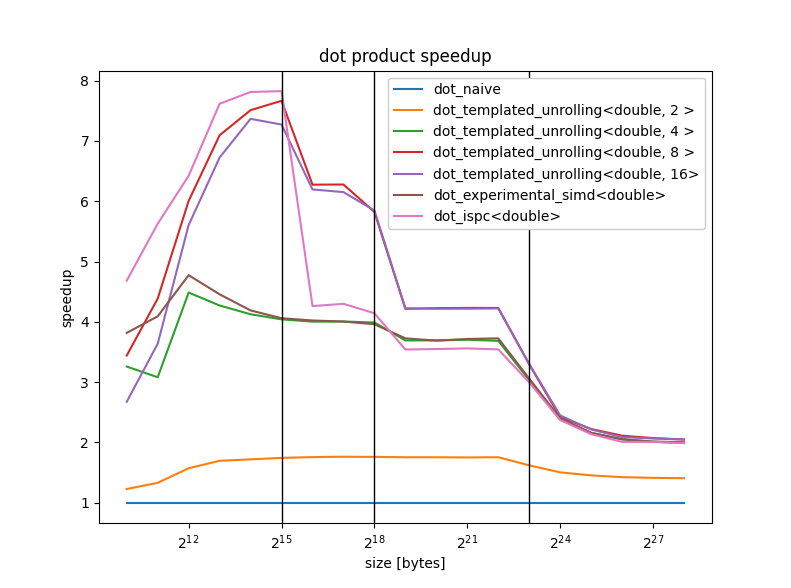

# vector-accumulator
This repository implements SIMD techniques in C++ for accelerating reductions on primitive types (float, double, int, ...)


## Context
I'm building on:
  * [SIMD intrinsics: A Benchmark Study](https://ishuah.com/2021/12/19/a-benchmark-study-simd-intrinsics/)
  * [An introduction to SIMD and ISPC in Rust](https://state.smerity.com/smerity/state/01E8RNH7HRRJT2A63NSX3N6SP1)

We are trying to accelerate the computation of reductions (sum of numbers, dot product between vectors) using some parallel processing. There exist concurrency in the reduction algorithm because two or more threads can partition the set and independently accumulate partial results. At the end the local accumulators are once again accumulated into the final result.


## Requirements and benefits of SIMD
When the input data is *stored in a contiguous chunk of memory* and properly aligned, the (logical) threads can be grouped into a single instruction. When applicable, SIMD is a more efficient paradigm than multithreading because of:
  * low overhead
  * automatic barriers
  * efficient use of transistors (spent on actual ALUs rather then on control logic)


## Pitfall when estimating program performance
If the target architecture has support for 4-lane SIMD registers does it implies a 4x speedup? NO.
>"Anyone can build a fast CPU. The trick is to build a fast system." - Seymour Cray

It doesn't matter the speed at which SIMD instructions can be performed if the system can't provide the ALUs with fresh data at the same pace. One typically finds the memory to be the main bottleneck in those computations. A throughput oriented mindset unlocks new optimizations like:
  * kernel fusion (omits memory transactions because partial results stay in registers)
  * hiding latency (overlaps memory reads with other useful computation)


## Project dependencies
  * cmake
  * (optional) C++ compiler that supports `std::experimental::simd`, gcc-10 works fine
  * (optional) [Intel ISPC compiler](https://github.com/ispc/ispc)

The build system is capable of recognizing the support of the experimental simd or ispc and automatically exclude the paths.


# C++ techniques
Implementing SIMD in C++ is a matter of:
  * hardware support: fortunately as january 2025 most cpus out there supports SIMD
  * portability: writing x86 intrinsics is not portable to ARM devices

The reference articles implements SIMD with hand written x86 intrinsics and the `ispc` intel compiler. I complete this list with:
  * [C++ experimental SIMD library](https://en.cppreference.com/w/cpp/experimental/simd)
  * metaprogramming assisted loop unrolling

A comparison of the program runtimes and generated code will be included in the repository.


## Metaprogramming assisted loop unrolling
If the iterations of a loop don't depend from each other, there is a chance the compiler may unroll the loop. This chance is increased by providing proper optimization flags to the compiler (i.e `-O3 -ffast-math` etc..) and by having for loops with compile time known bounds.

```(c)
for (int i = 0; i < 4; ++i) {
    z[i] = x[i] + y[i];
}

// may be unrolled into
z[0] = x[0] + y[0];
z[1] = x[1] + y[1];
z[2] = x[2] + y[2];
z[3] = x[3] + y[3];
```

C++ metaprogramming allows the programmer to select a compile time the desired unroll factor and produce multiple implementations to compare.

```(c++)
template <typename T, size_t UNROLL_FACTOR>
T dot_simd(const std::vector<T>& x, const std::vector<T>& y) {
    assert(x.size() % UNROLL_FACTOR == 0);

	std::array<T, UNROLL_FACTOR> acc{0};

	for (size_t i = 0; i < x.size(); i += UNROLL_FACTOR) {
		for (auto j = 0; j < UNROLL_FACTOR; ++j) {
			acc[j] += x[i+j] * y[i+j];
		}
	}

	return std::accumulate(
		acc.begin(),
		acc.end(),
		0.0
	);
}
```

# Result discussion
The benchmarks have been executed on an `Intel Core i7-8550U` laptop (so some instability is present due to frequency scaling) and show a clear improvement in throughput with SIMD techniques.



This work is an example of a microbenchmark. We are profiling an extremely specific algorithm (parallel reductions), which is only a small fraction of a numerical computing program. Nevertheless the results highlight an important concept: *memory bound computing*.

Throughput is dependent on memory locality of the data to be processed. The speedup of SIMD implementations around 4-8x is attenuated when the arrays don't fit in caches anymore. If there were any differences between the SIMD implementations, those differences are irrelevant in a memory bound regime (see the rightmost part of the plot). In conclusion:
  * I see why GPU vendors are pushing for high bandwidth memories (HBM)
  * In the memory bound region of computing the CPU is waiting for data to be fetched, in that time the resources could be allocated on other useful tasks

# What are really the relevant aspects of performance?
When compiling this program with the `-Ofast` flag, every implementation is as fast as it could be. All it took was to relax a little the constraints of floating point operations, and the compiler figured out the optimal vectorization strategy. All the sophisticated techniques were ultimately pointless, what to do?


I'd suggest to *work on higher level stuff* as numerical codes are not a single algorithm, rather a complex sequence of data processing with intricate data dependencies.
